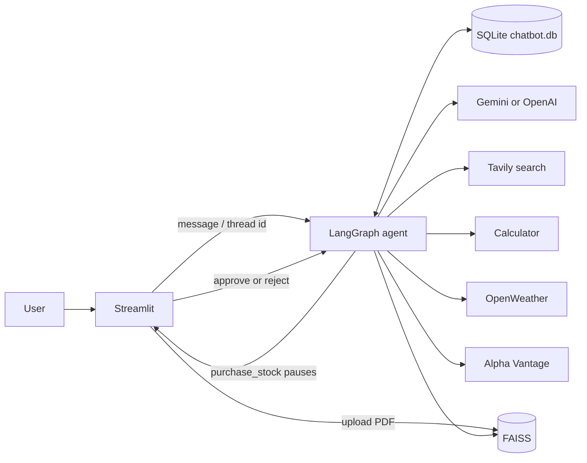
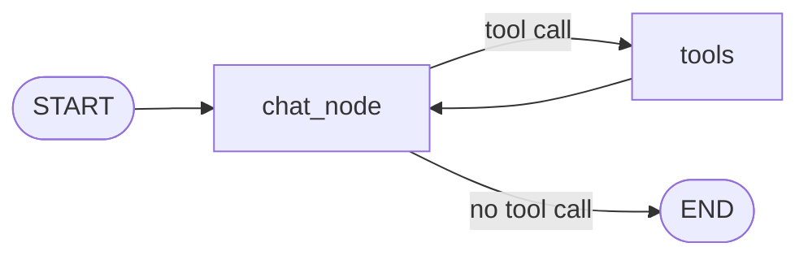

# Agentic Chatbot with LangGraph and Streamlit

A learning project: a tool-using chatbot built with LangGraph, a Streamlit UI, and a local SQLite database for conversation memory. Run it on your machine, or deploy it to Streamlit Community Cloud. No AWS account is required.

## What it does

- Chat with Gemini or OpenAI through a LangGraph agent
- Keep conversation threads in SQLite (`chatbot.db`)
- Search the web (Tavily), do math, look up weather and stock prices
- Answer questions from an uploaded PDF (FAISS RAG)
- Pause stock purchases for human approval before they complete

```
streamlit_app.py   Streamlit UI (chat, threads, PDF upload, HITL buttons)
backend.py      LangGraph graph, tools, SQLite checkpointer, FAISS RAG
chatbot.db      Created automatically. Conversation memory.
faiss_db/       Created when you upload a PDF.
```

## Architecture

The user talks to Streamlit. Streamlit sends each message to a LangGraph agent. The agent either answers with the LLM or calls a tool, then answers. Chat history is stored in SQLite. Uploaded PDFs are indexed in FAISS for `rag_tool`.



Inside the agent, the LLM and tools loop until there is a final answer:



`purchase_stock` is the exception: it pauses at `tools` until the user clicks Approve or Reject in Streamlit, then the loop continues.

## Prerequisites

- Python 3.11 or 3.12 (not 3.14 — several packages, including `pydantic`, do not support it yet)
- API keys (free tiers are enough for testing):
  - [Google Gemini](https://aistudio.google.com/apikey) (`GOOGLE_API_KEY`) **or** [OpenAI](https://platform.openai.com/api-keys) (`OPENAI_API_KEY`)
  - [Tavily](https://tavily.com/) (`TAVILY_API_KEY`)
  - [OpenWeather](https://openweathermap.org/api) (`OPENWEATHER_API_KEY`)
  - [Alpha Vantage](https://www.alphavantage.co/support/#api-key) (`ALPHAVANTAGE_API_KEY`)
- Optional: [LangSmith](https://smith.langchain.com/) for tracing

## Run locally

### 1. Clone the repo and create a virtual environment

```bash
git clone https://github.com/<your-username>/Agentic-Chatbot-using-LangGraph.git
cd Agentic-Chatbot-using-LangGraph

python3.11 -m venv .venv
source .venv/bin/activate          # Windows: .venv\Scripts\activate
pip install -r requirements.txt
```

### 2. Add your API keys

```bash
cp .env.example .env
```

Edit `.env` and paste real keys. The app loads this file on startup.

To use OpenAI instead of Gemini, set:

```env
LLM_PROVIDER=openai
OPENAI_API_KEY=sk-...
```

Optional: `OPENAI_MODEL=gpt-4o` for higher quality (slower and more expensive than the default `gpt-4o-mini`). Re-upload any PDF after switching providers, because embeddings are not interchangeable.

### 3. Start Streamlit

```bash
streamlit run streamlit_app.py
```

Open [http://localhost:8501](http://localhost:8501). SQLite creates `chatbot.db` in the project folder the first time the graph runs.

Stop the app with `Ctrl+C`.

## Test locally

Use these checks after the app is running.

| What to test      | How                                      | Expected result                                      |
| ----------------- | ---------------------------------------- | ---------------------------------------------------- |
| Basic chat        | Send `Hello, who are you?`               | Direct answer, no tool call                          |
| Calculator        | `What is 17 * 24?`                       | Status shows `calculator`, then the product          |
| Weather           | `What is the weather in London?`         | Current conditions from OpenWeather                  |
| Web search        | `What is today's top tech news?`         | Tavily search, then a summary                        |
| Stock price       | `What is the current price of AAPL?`     | Quote from Alpha Vantage                             |
| Human-in-the-loop | `Buy 3 shares of TSLA`                   | Chat input disables; Approve / Reject buttons appear |
| Approve purchase  | Click **Approve Purchase**               | Graph resumes and confirms the order                 |
| Reject purchase   | Click **Reject Purchase**                | Graph resumes and reports the purchase was declined  |
| PDF RAG           | Attach a PDF and ask a question about it | File is indexed; answer cites the document           |
| RAG with no PDF   | Ask about a document before uploading    | App asks you to upload a PDF first                   |
| New chat          | Sidebar **New Chat**                     | Empty conversation, new thread id                    |
| Thread switch     | Click an older thread in the sidebar     | Previous messages reload from SQLite                 |

Conversation history survives a restart because it lives in `chatbot.db`. Delete that file if you want a clean slate.

If something fails, the usual causes are a missing key in `.env`, a free-tier rate limit (especially Alpha Vantage), or no PDF uploaded yet for RAG.

## Deploy on Streamlit Community Cloud

This is the fastest hosted option for a Streamlit app.

1. Push the project to a GitHub repository.
2. Go to [share.streamlit.io](https://share.streamlit.io) and sign in with GitHub.
3. Click **Create app** and select your repo.
4. Set:
   - **Main file path:** `streamlit_app.py`
   - **Python version:** 3.11 (also listed in `runtime.txt`)
5. Open **Advanced settings → Secrets** and paste the same keys as `.env`, using TOML:

```toml
LLM_PROVIDER = "google"
GOOGLE_API_KEY = "your-google-gemini-api-key"
OPENAI_API_KEY = "your-openai-api-key"
TAVILY_API_KEY = "your-tavily-api-key"
OPENWEATHER_API_KEY = "your-openweather-api-key"
ALPHAVANTAGE_API_KEY = "your-alphavantage-api-key"
```

6. Click **Deploy**. Streamlit installs `requirements.txt`, installs `libgomp1` from `packages.txt` (needed by FAISS), and starts the app.

After deploy, repeat the local test table against the public URL.

### Streamlit Cloud notes

- App secrets are copied into environment variables on startup, so the LangChain clients keep using `os.getenv(...)`.
- The filesystem is ephemeral. `chatbot.db` and `faiss_db_*` work while the app is running, but they can disappear when Streamlit restarts the container. That is acceptable for this learning project. Re-upload a PDF after a reboot if RAG answers go missing.
- Do not commit `.env` or `.streamlit/secrets.toml`.

## Optional: run with Docker on your machine

Docker is not required. Use it only if you want a containerized local run.

```bash
docker build -t agentic-chatbot .
docker run --rm -p 8501:8501 --env-file .env agentic-chatbot
```

Then open [http://localhost:8501](http://localhost:8501).

## Project layout

```
streamlit_app.py       Chat UI
pages/                 Implementation / architecture page
backend.py             LangGraph agent, tools, SQLite, FAISS
requirements.txt       Python dependencies
runtime.txt            Python 3.11 for Streamlit Cloud
packages.txt           System package for FAISS on Streamlit Cloud
.env.example           Template for local API keys
.streamlit/            Streamlit config and secrets example
Dockerfile             Optional local container
```

